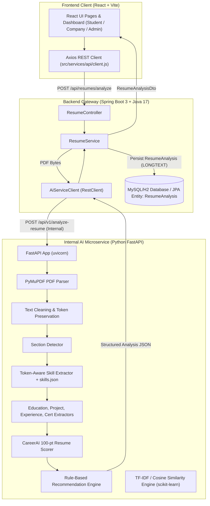

# CareerAI System Architecture (Phase 4A Updated)

## 1. Architectural Overview
CareerAI uses a 3-tier architecture with Spring Boot acting as the central API Gateway & Business Logic Core, and Python FastAPI acting as an internal AI microservice for local resume intelligence processing.

## 2. Component Responsibilities
1. **Frontend (React)**:
   - Collects user interactions, resume uploads, and triggers analysis via Spring Boot.
   - Renders readiness score (0-100), category breakdown radar chart, detected skills, education, projects, experience, certifications, and rule-based suggestions.
   - React NEVER communicates with the Python AI service directly.
2. **Backend (Spring Boot Gateway)**:
   - Handles security authentication, role checks, active resume retrieval, and JPA persistence (MySQL-compatible `MEDIUMBLOB` and `LONGTEXT`).
   - Prevents duplicate applications with composite unique constraints at the database level.
   - Computes **Eligibility Contribution** (0 or 10 pts) for Job Matches based on firm business rules (CGPA, degree, batch year, backlogs).
   - Combines AI Relevance and Eligibility for a Final Match Percentage out of 100%.
   - `AiServiceClient` sends internal HTTP POST requests to Python.
   - **Schema Migration Limitation**: Currently using Hibernate `ddl-auto=update` as a temporary bootstrap mechanism for initial rollout. This is NOT the final production schema migration strategy.
   - **Phase 4 Status**: Verified using live Aiven MySQL with TLS. Schema initialized and persistence verified across restarts.
3. **AI Service (Python FastAPI)**:
   - Lightweight Python microservice deployed as a public web service, secured strictly by an environment-based `x-api-key`.
   - Computes deterministic 100-pt CareerAI Resume Readiness Score (Skills 25, Projects 20, Education 15, Experience 15, Certifications 10, Structure 10, Completeness 5).
   - Computes **AI Relevance Score (Max 90 pts)** for job matches (Required Skills 60 pts, Optional Skills 15 pts, Semantic Similarity via TF-IDF 15 pts).
