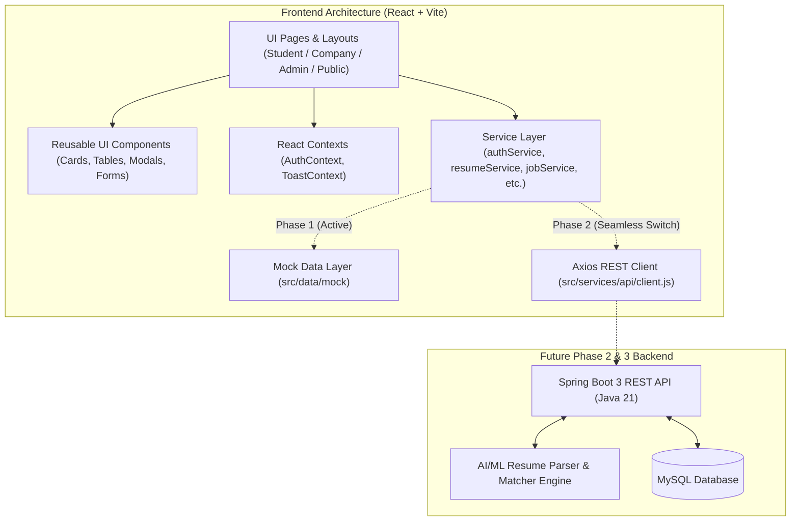

# CareerAI System Architecture

## 1. Architectural Philosophy
CareerAI is engineered following modular separation of concerns. While Phase 1 focuses exclusively on the Frontend client layer, every single component, data contract, and service method is built with strict forward-compatibility for the future Java 21 Spring Boot backend and AI microservice.



## 2. Directory Structure Conventions
```
frontend/src/
├── components/
│   ├── common/        # Atoms & Molecules (Buttons, Inputs, Modals, Badges, Tabs)
│   ├── layout/        # Navbar, Sidebar, Footer, MobileNav, PageHeader
│   ├── dashboard/     # Metric cards, quick action banners
│   ├── resume/        # Visual radar/gauge charts, breakdown bars, dropzones
│   ├── jobs/          # Filter drawer, JobCard, match indicator
│   ├── applications/  # Application status stepper, table rows
│   └── charts/        # Recharts responsive wrappers
├── layouts/           # App layouts (PublicLayout, DashboardLayout)
├── pages/             # Route-level components segmented by role
├── routes/            # Route declarations and ProtectedRoute guards
├── services/api/      # Abstraction layer returning Promises (ready for backend)
├── data/mock/         # Strongly-typed mock records mirroring relational entities
├── context/           # Global application state (Auth, Notification Toasts)
├── utils/             # Formatters (currency, date, score color coding)
└── constants/         # Theme tokens, navigation menus, role enums
```

## 3. Design System & Tokens
A centralized bespoke dark-first palette is defined in `constants/themeTokens.js` and wired directly into Tailwind CSS:
- `bg.main` / `backgroundPrimary`: `#08090C` (Deep obsidian dark)
- `bg.secondary` / `backgroundSecondary`: `#0E1015` (Panel surface)
- `surface` / `card`: `#141720` (Elevated component card surface)
- `surfaceElevated`: `#1C202C` (Modals and dropdown overlays)
- `surfaceIvory`: `#F7F4EB` (Warm cream/ivory highlight for hero moments and select surfaces)
- `brandPrimary` / `wine`: `#991B32` (Deep burgundy / rich wine accent for CTAs and primary emphasis)
- `highlightCoral`: `#E05D5D` (Muted coral / rose-red highlight)
- `semanticBlue`: `#38BDF8` (Restrained cool blue for technology pills and informational badges)
- `textPrimary`: `#F8FAFC` (High contrast crisp white)
- `textMuted`: `#8E98A8` (Legible technical grey)
- `border`: `#222634` (Soft boundary tone)

## 4. API Service Abstraction Pattern
Components never import raw mock JSON directly. Instead:
```javascript
// Example in a component:
const { data, loading, error } = await jobService.getJobs(filters);
```
Under the hood, `jobService` returns structured responses matching standard REST envelope specifications:
```javascript
{
  success: true,
  data: [...],
  total: 24,
  page: 1
}
```
When Phase 2 begins, the implementation inside `jobService.js` simply delegates to `apiClient.get('/api/jobs')` with zero breaking changes to pages or components.
