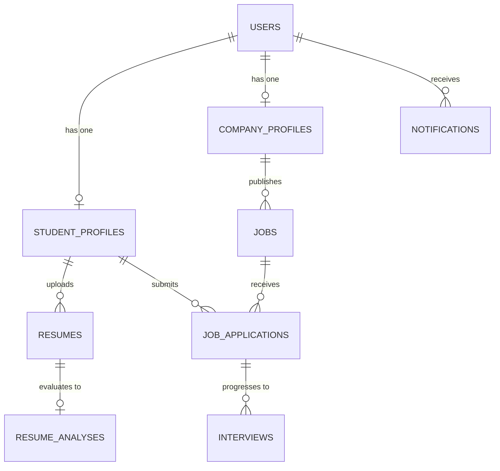

# CareerAI Relational Database Schema Design (Phase 4A Updated)

## Overview
Designed for MySQL 8+ / PostgreSQL / H2 with Spring Data JPA and Hibernate. All foreign keys, constraints, and audit fields are specified below.

**Phase 4 Status**: Database migration/configuration implemented. H2 regression verified. Live MySQL persistence verification pending due to unavailable local MySQL runtime.

> [!WARNING]
> **Schema Migration Limitation**: Hibernate `ddl-auto=update` is used as a temporary bootstrap mechanism for the initial rollout. This is NOT the final production schema migration strategy.

## Tables & Relationships

### 1. `users`
- `id` (BIGINT, PK, AUTO_INCREMENT)
- `email` (VARCHAR(150), UNIQUE, NOT NULL)
- `password_hash` (VARCHAR(255), NOT NULL)
- `role` (ENUM('ROLE_STUDENT', 'ROLE_COMPANY', 'ROLE_ADMIN'), NOT NULL)
- `is_active` (BOOLEAN, DEFAULT TRUE)
- `created_at` (TIMESTAMP, DEFAULT CURRENT_TIMESTAMP)
- `updated_at` (TIMESTAMP)

### 2. `student_profiles`
- `id` (BIGINT, PK, AUTO_INCREMENT)
- `user_id` (BIGINT, FK -> users.id, UNIQUE, NOT NULL)
- `full_name` (VARCHAR(120), NOT NULL)
- `phone` (VARCHAR(20))
- `college` (VARCHAR(150))
- `branch` (VARCHAR(100))
- `graduation_year` (INT)
- `cgpa` (DECIMAL(3,2))
- `profile_completion_percentage` (INT, DEFAULT 0)
- `headline` (VARCHAR(200))
- `bio` (TEXT)
- `skills` (TEXT)
- `github_url` (VARCHAR(255))
- `linkedin_url` (VARCHAR(255))
- `portfolio_url` (VARCHAR(255))

### 3. `company_profiles`
- `id` (BIGINT, PK, AUTO_INCREMENT)
- `user_id` (BIGINT, FK -> users.id, UNIQUE, NOT NULL)
- `company_name` (VARCHAR(150), NOT NULL)
- `industry` (VARCHAR(100))
- `website` (VARCHAR(255))
- `location` (VARCHAR(150))
- `description` (TEXT)
- `is_verified` (BOOLEAN, DEFAULT FALSE)

### 4. `resumes`
- `id` (BIGINT, PK, AUTO_INCREMENT)
- `student_id` (BIGINT, FK -> student_profiles.id, NOT NULL)
- `file_name` (VARCHAR(255), NOT NULL)
- `file_size_bytes` (BIGINT, NOT NULL)
- `content_type` (VARCHAR(100), NOT NULL)
- `file_data` (MEDIUMBLOB, NOT NULL)
- `is_active` (BOOLEAN, DEFAULT TRUE)
- `uploaded_at` (TIMESTAMP, DEFAULT CURRENT_TIMESTAMP)

### 5. `resume_analyses` (Phase 3B Implemented)
- `id` (BIGINT, PK, AUTO_INCREMENT)
- `resume_id` (BIGINT, FK -> resumes.id, UNIQUE, NOT NULL)
- `overall_score` (INT, NOT NULL) -- 0-100 total CareerAI Readiness Score
- `skills_score` (INT, NOT NULL, DEFAULT 0) -- max 25
- `projects_score` (INT, NOT NULL, DEFAULT 0) -- max 20
- `education_score` (INT, NOT NULL, DEFAULT 0) -- max 15
- `experience_score` (INT, NOT NULL, DEFAULT 0) -- max 15
- `certifications_score` (INT, NOT NULL, DEFAULT 0) -- max 10
- `structure_score` (INT, NOT NULL, DEFAULT 0) -- max 10
- `completeness_score` (INT, NOT NULL, DEFAULT 0) -- max 5
- `completeness_percentage` (INT, NOT NULL, DEFAULT 0)
- `page_count` (INT, NOT NULL, DEFAULT 1)
- `raw_analysis_json` (LONGTEXT, NOT NULL) -- Stores losslessly serialized python analysis response
- `analyzed_at` (TIMESTAMP, DEFAULT CURRENT_TIMESTAMP)

### 6. `jobs`
- `id` (BIGINT, PK, AUTO_INCREMENT)
- `company_id` (BIGINT, FK -> company_profiles.id, NOT NULL)
- `title` (VARCHAR(150), NOT NULL)
- `description` (TEXT, NOT NULL)
- `location` (VARCHAR(100), NOT NULL)
- `salary_range` (VARCHAR(100), NOT NULL)
- `job_type` (ENUM('Full-time', 'Internship', 'Contract', 'Remote'), NOT NULL)
- `experience_level` (VARCHAR(50), NOT NULL)
- `min_cgpa` (DECIMAL(3,2), DEFAULT 0.0)
- `required_skills` (TEXT, NOT NULL)
- `responsibilities` (TEXT)
- `benefits` (TEXT)
- `is_active` (BOOLEAN, DEFAULT TRUE)
- `created_at` (TIMESTAMP, DEFAULT CURRENT_TIMESTAMP)

### 7. `job_applications`
- `id` (BIGINT, PK, AUTO_INCREMENT)
- `job_id` (BIGINT, FK -> jobs.id, NOT NULL)
- `student_id` (BIGINT, FK -> student_profiles.id, NOT NULL)
- `resume_id` (BIGINT, FK -> resumes.id, NOT NULL)
- `match_percentage` (INT, NOT NULL)
- `status` (ENUM('Applied', 'Under Review', 'Shortlisted', 'Interview', 'Selected', 'Rejected'), DEFAULT 'Applied')
- `applied_at` (TIMESTAMP, DEFAULT CURRENT_TIMESTAMP)
- `updated_at` (TIMESTAMP)
- **Constraints**: UNIQUE(`student_id`, `job_id`) - CareerAI permits at most one application record ever per student and job.

### 8. `interviews`
- `id` (BIGINT, PK, AUTO_INCREMENT)
- `application_id` (BIGINT, FK -> job_applications.id, NOT NULL)
- `scheduled_time` (TIMESTAMP, NOT NULL)
- `interview_type` (ENUM('Technical Round 1', 'Technical Round 2', 'HR Round', 'Managerial'), NOT NULL)
- `meeting_link` (VARCHAR(255))
- `status` (ENUM('Scheduled', 'Completed', 'Cancelled', 'Rescheduled'), DEFAULT 'Scheduled')
- `notes` (TEXT)

### 9. `notifications`
- `id` (BIGINT, PK, AUTO_INCREMENT)
- `user_id` (BIGINT, FK -> users.id, NOT NULL)
- `title` (VARCHAR(150), NOT NULL)
- `message` (TEXT, NOT NULL)
- `type` (ENUM('INFO', 'APPLICATION_UPDATE', 'INTERVIEW_ALERT', 'RESUME_ANALYSIS'), NOT NULL)
- `is_read` (BOOLEAN, DEFAULT FALSE)
- `created_at` (TIMESTAMP, DEFAULT CURRENT_TIMESTAMP)
